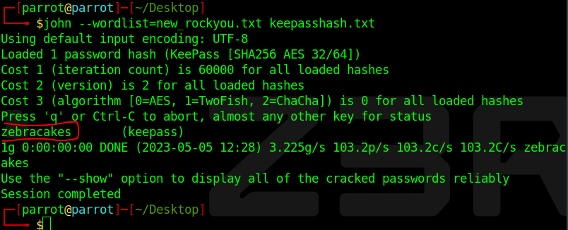

# Password Cracking - 2

Writeup by: [j4asper](https://github.com/j4asper)

---

## Challenge Description

The flag is the password for this vault.

[keepass.kdbx](./files/keepass.kdbx)

## Challenge Solution

For this challenge we will be using John the ripper to crack the password hash. First we need to obtain the password hash. We need to use `keepass2john` to make a john compatible hash. We use the command below.

```console
keepass2john keepass.kdbx > keepasshash.txt
```

This command takes the password hash and then outputs it into the `keepasshash.txt` file.

Now we can bruteforce the password with john using the command below:

```console
john --wordlist=/usr/share/wordlists/rockyou.txt KeepassHash.txt
```

*Replace the wordlist path if yours is placed somewhere else.*

Now this is going to take a lot of time. But finally when we crack one password challenge, we can crack others faster.



When john has found the password, we can see that it's `zebracakes`, and that's the flag.

Now keep in mind that the password included "zebra", this is also the logo of Punk Security. This might mean that we can make a new password list with only entries in rouckyou.txt that includes "zebra". To make this list, i made a quick python script:

```py
with open("rockyou.txt", "r", errors="ignore") as f:
    passwords = [pw.strip() for pw in f.readlines()]

new_passwords = []

for password in passwords:
    if "zebra" in password.lower():
        new_passwords.append(password)

with open("new_rockyou.txt", "w") as f:
    f.write("\n".join(new_passwords))
```

This will make a `new_rockyou.txt` file with only entries that includes "zebra" from the original `rockyou.txt` list.
You can also [download it here](./files/new_rockyou.txt) if you want to.
