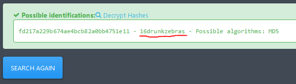

# Password Cracking - 5

Writeup by: [j4asper](https://github.com/j4asper)

---

## Challenge Description

`fd217a229b674ae4bcb82a0bb4751e11`

The flag is the password corresponding with this hash.

## Challenge Solution

This one was pretty easy. I usually run hashes through [hashes.com/en/tools/hash_identifier](https://hashes.com/en/tools/hash_identifier) to identify hashes. And right away it sees that it's an MD5 hash and shows the password. `16drunkzebras`.

