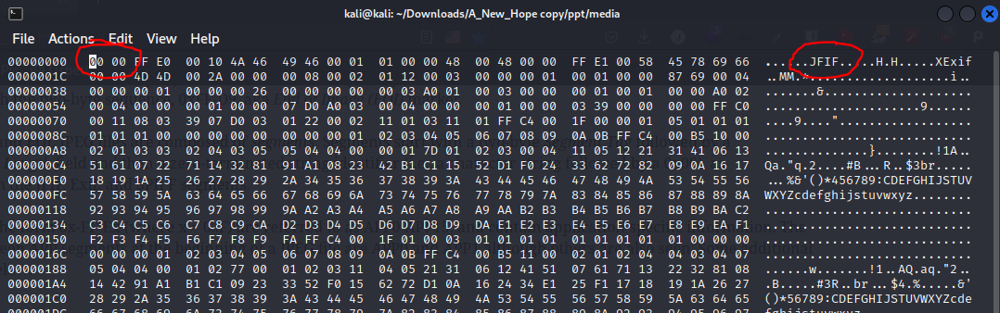
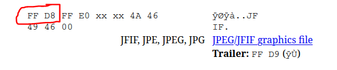
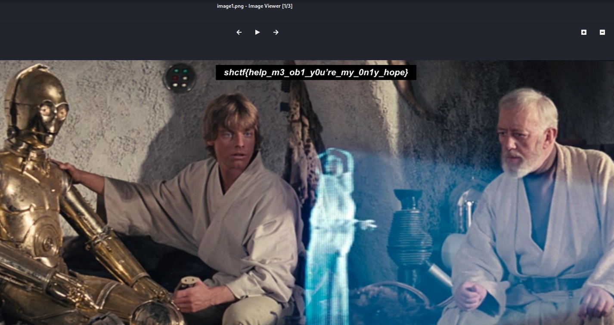

# A New Hope

Writeup by: [j4asper](https://github.com/j4asper)

---

## Challenge Description

Princess Leia has been kidnapped! She managed to send a message to this droid we have recovered. It was damaged while we were recovering it however. It seems that sometimes you have to tear something down, in order to build them back up.

Can you recover the message?

[A_New_Hope.pptx](./files/A_New_Hope.pptx)

## Challenge Solution

Opening up the powerpoint reveals nothing special. We see some images, nothing really useful. So let's dig deeper. Some know, that powerpoint files are just a .zip folder containing the data represented in the powerpoint program. We can rename the folder to see what files it has.

After some digging around, you may have seen an image in the `/ppt/media` folder called `image1.png` that can't be opened, this might be where the flag is hidden. Since the image is corrupted, we need to fix it, so let's try to use the `hexedit` command so we can fix the file. To open the file in hexedit, you simple use the following command `hexedit image1.png`.

This reveals something interesting. We notice that the file starts with 4 zeros, which it shouldn't do. Also, the file name `image1.png` doesn't match the "JFIF" file signature found in the hex data of the image file. Now let's fix the file. I usually use [this website](https://www.garykessler.net/library/file_sigs.html) to find file signatures. Let's seach for JFIF on the site to find the starting hex values of a JFIF (jpeg) file.

Now that we know how the file should start, we can fix it. Open hexedit again and fix the first 4 hex values. Save it by pressing CTRL+S.

Now you should be able to open the image, if not, try to change the file extension from `.png` to `.jpeg`.

And there you have the flag, at the top of the image.
