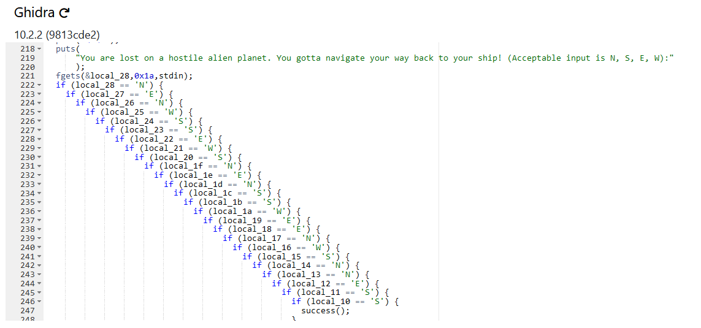

# Acheron

Writeup by: [j4asper](https://github.com/j4asper)

---

## Challenge Description

While researching a foreign planet, you and your team discover a cave with some strange eggs. Upon inspection, something attacked your team. You got separated from them and knocked unconscious. Once awake, you begin running to your ship to regroup with your team. The problem is, you don't remember the way. Find your way back to your ship.

```py
from pwn import *
p = remote("spaceheroes-acheron.chals.io", 443, ssl=True, sni="spaceheroes-acheron.chals.io")
p.interactive()
```

[Acheron](./files/Acheron)

## Challenge Solution

First thing to do is to create a python file with the content showed in the challenge description in order to get the flag from the server.

You can try to run the file and see that it needs navigation instructions in order to get the flag.

Since we have access to the executable running on the server, we can try to use a decompiler and see if there is anything interresting. I tend to use [dogbolt.org](https://dogbolt.org/), it tries to decompile the executable using different tools. When uploading the file, i look through the different decompiler content, and find Ghidras content interesting.

[]

We can see excactly what the program want's as the input, just reading through the many if statements and writing down the different letters we get the following string: `NENWSSEWSNENSSWEENWSNNESS` now paste the string into the python script, and you will get the flag.
