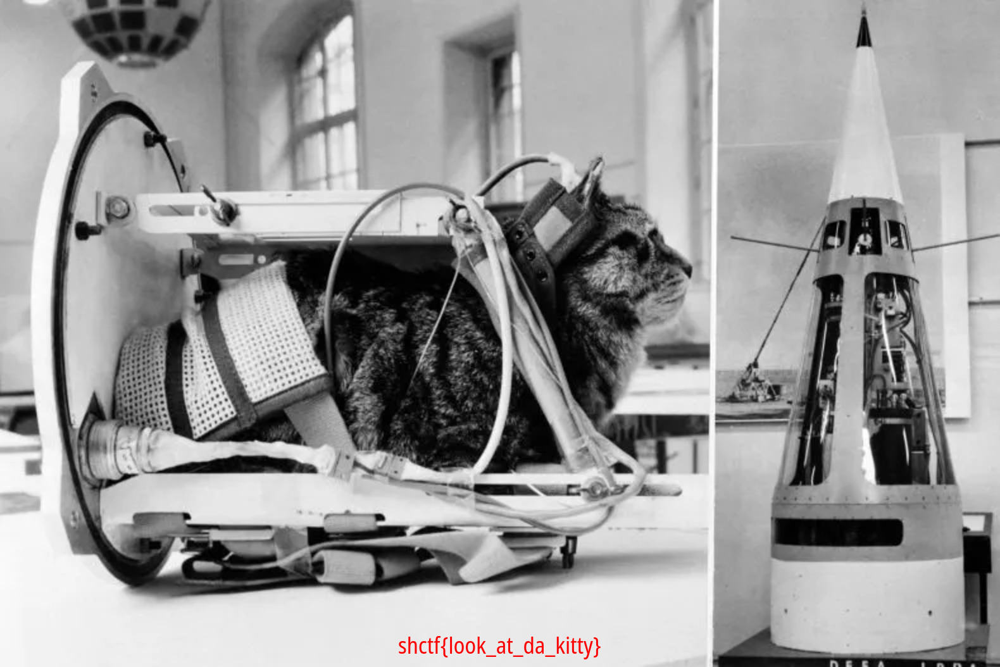

# Félicette

Writeup by: [j4asper](https://github.com/j4asper)

---

## Challenge Description

a cat in space, eating a croissant, while starting a revolution.

[chall.jpg.pcap](./files/chall.jpg.pcap)

## Challenge Solution

In the wireshark capture file i noticed that the large amount of data was a file stream, it was sending an image, i noticed this by looking at some of the first packets sent, that matched the jpeg file signature. When i knew this, i could start making the python script that could take the many packets and piece them together to form an image. Scapy is needed here to load the wireshark file.

```py
from scapy.all import rdpcap

packets = rdpcap("chall.jpg.pcap")

hex_data = []
for packet in packets:
    hex_data.append(packet.lastlayer().fields['load'])

with open("Felicette.jpg", "wb") as f:
    for i in hex_data:
        f.write(i)
```

Now when running this script, we get the output jpg file with a flag in it.


