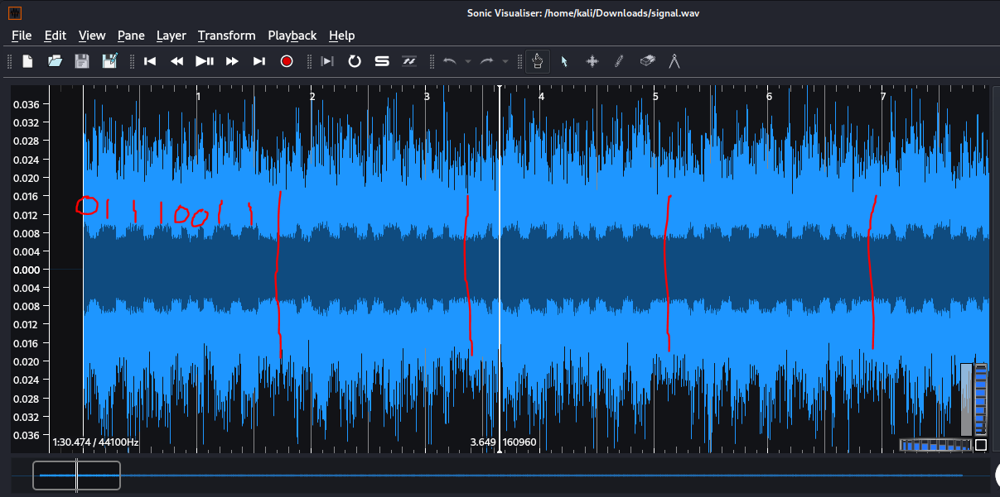

# My God, it's full of .- ... -.-. .. ..

Writeup by: [j4asper](https://github.com/j4asper)

---

## Challenge Description

If sound can't travel in a vacuum then how did a microphone pick this up in space unless space is a made up concept designed to make us fear leaving Earth and joining with Xenu and the Galactic Confederacy?

[signal.wav](./files/signal.wav)

## Challenge Solution

I really hope there is a tool for this, i couldn't fin one, so this solution is kinda scuffed... So we have been given an audio file, and the challenge title suggests that it's morse code, but it's not. Upon closer inspection in [Sonic Visualizer](https://installati.one/install-sonic-visualiser-kalilinux/), it seems like it could be binary bumps in the audio track. Aaand indeed it is...

In the audio track (with some fine adjusting in zoom) you can see something like in the picture below.

[]

You can see that there are large spaces that seperates each binary block, and thin/thicc blocks representing a 0 or 1. Because I don't know if there is a tool for this, i did it by hand... When reading it all, you get all this binary code:

```
01110011 01101000 01100011 01110100 01100110 01111011 01001110 00110000 00100000 00110001 00100000 01100011 00110100 01101110 00100000 01001000 00110011 00110100 01110010 00100000 01110101 00100000 00111000 00110011 00110011 01010000 01011111 00111000 00110000 00110000 01110000 00101000 01001001 01101110 00101001 00100000 00111100 00100000 00101111 01100100 01100101 01110110 00101111 01101110 01110101 01101100 01101100 01110011 01110000 01100001 01100011 01100101 01111101
```

Now to convert it to a flag, we just put it into [CyberChef](https://gchq.github.io/CyberChef/#recipe=From_Binary('Space',8)) and use the "From binary" operation, and then you have the flag.

Please let me know if there is a tool for this.
