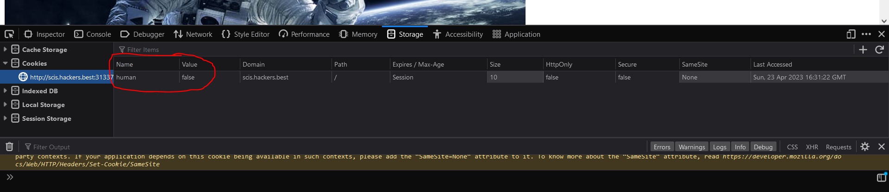
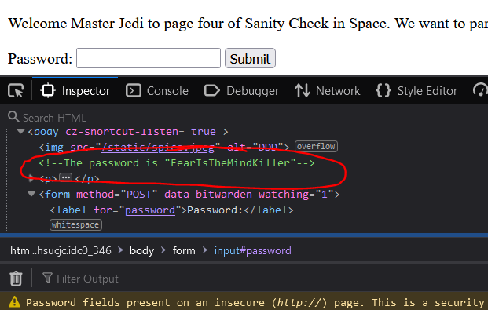
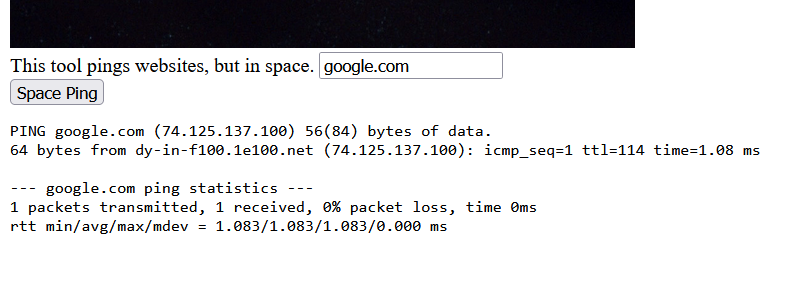
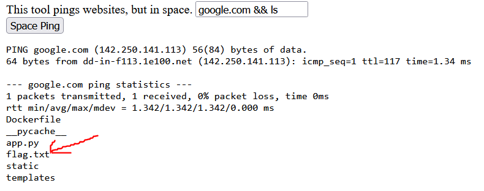
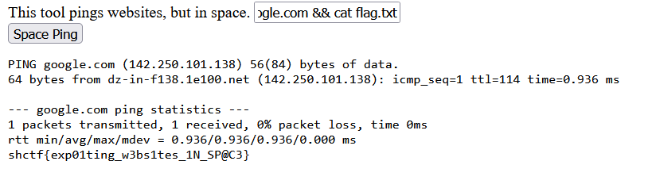

# Sanity Check In Space

Writeup by: [j4asper](https://github.com/j4asper)

---

## Challenge Description

Man, web exploitation sure is fun. Sometimes you just need to go back to the basics, you know what I mean? Everything you need to get started on your journey to becoming a web master is here.

p.s: You can make anything space themed if you try hard enough.

http://scis.hackers.best:31337/

## Challenge Solution

Go to the given web adress, the first page we see is welcome message and a picture of a robot. The picture is a hint. Many websites use robots.txt to keep google or other search engines from indexing some pages. When going to the url `scis.hackers.best:31337/robots.txt` we see the following piece of text:

```Welcome to page two of Sanity Check in space, here's some robots.txt stuff. User-agent: * Disallow: humans.txt/```

This says that humans.txt shouldn't be indexed, let's try to go to that page at `scis.hackers.best:31337/humans.txt`

Now we see a text that it has to be sure that we are a human. Also when looking at the big spaceman picture, we get a hint for what we can look at. The astronaut is holding a cookie, so let's take a look at them. In most, if not all browsers, you can view the cookies in the developer tools that is accessed by pressing **F12**, at least if you are using firefox.



We can see a field in the cookie that says `human` and it is set to false, let's try to edit it to say `true` and reload the page to see what happens.

Now the text on the page has changed, it now say "Wow, you really are human, celebrate with us by visiting arrakis", now let's try to go to chat page at `scis.hackers.best:31337/arrakis`

At the buttom of the page, there is a field for a password. Let's pull out the developer tools again, and look at the source. In the source we find a comment containing the password.



When you input the password, the text above the password box changes, and says that a challenge "awaits you on krypton". So now, let's go to krypton at `scis.hackers.best:31337/krypton`

Now we have a box that pings websites, so let's try to input a domain.



It looks like the input box takes a domain and uses the commandline to get the output seen on the website. Let's try to exploit this by adding some extra stuff after the domain. So now we can assume that the program runs the following `ping <domain>` in linux, you can run two commands in one input by adding `&&` after the first command, so let's try to see if it works by inputting the following text `google.com && ls`



The theory is correct. It is indeed running the input in the terminal and we can see that there is a file called `flag.txt` in the current directory. We can quickly assume that this is the flag we need to get. Let's use the `cat` command this time to see the text inside the file. So our input will be `google.com && cat flag.txt`



Now at the buttom, we got the flag.
