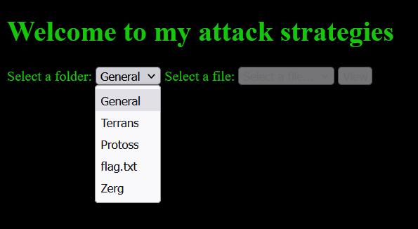
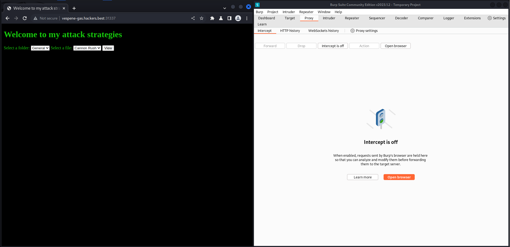
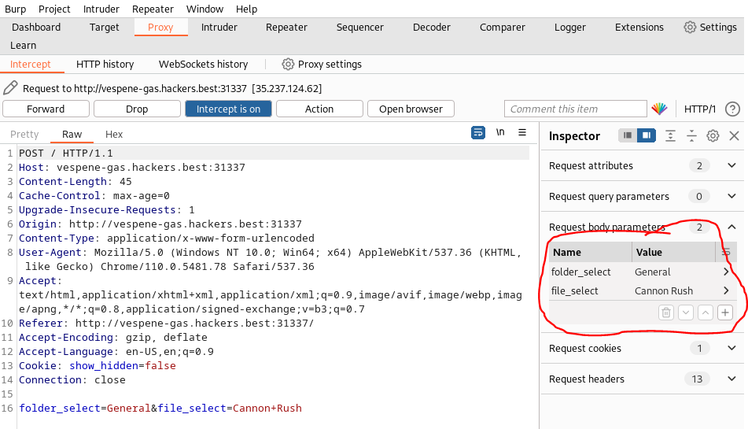
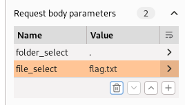
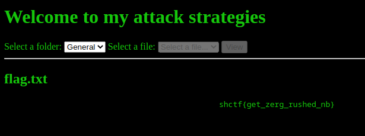

# attack-strategies

Writeup by: [j4asper](https://github.com/j4asper)

---

## Challenge Description

The StarCraft III Interplanetary Newbie Championship is almost live and I was assigned to take care of teaching everyone in the Newbie-84 planet how to play. I made a blog so each individual can choose their favorite races and strategies to learn before the tournament. I will secretly participate and to give them a change, I hid my go to strategy somewhere on the website. Wanna try finding it?

http://vespene-gas.hackers.best:31337/

## Challenge Solution

After looking around the site and source, i notice that there is a cookie with a "show_hidden" key set to "false". By editting this value to "true" and reload the page, we now see a "flag.txt" folder in the dropdown menu.



It is important for this challenge to understand what folders a loaded into the dropdown. We can see a script in the html code of the website.

```js

document.getElementById('folder_select').addEventListener('change', function() {
    var folderSelect = document.getElementById('folder_select');
    var fileSelect = document.getElementById('file_select');
    var submitBtn = document.querySelector('input[type="submit"]');
    var folder = folderSelect.value;
    if (folder) {
        fetch('/files/' + folder)
            .then(response => response.json())
            .then(data => {
                fileSelect.innerHTML = '';
                for (var i = 0; i < data.length; i++) {
                    var option = document.createElement('option');
                    option.value = data[i];
                    option.text = data[i];
                    fileSelect.appendChild(option);
                }
                fileSelect.disabled = false;
                submitBtn.disabled = false;
            });
    } else {
        fileSelect.innerHTML = '<option value="" selected>Select a file...</option>';
        fileSelect.disabled = true;
        submitBtn.disabled = true;
    }
});
```

This script shows that the folders are fetched from the /files/ directory, so let's try to access te flag that way.

Going to `http://vespene-gas.hackers.best:31337/files/flag.txt` returns an Internal server error, while `http://vespene-gas.hackers.best:31337/files/General` doesn't. When going back to the main page of the site and selecting a folder and a file and pressing the View button, we see that the page makes a request POST request with some form data. For the General folder and "Cannon Rush" file, the Post request form data looks like this:

```
folder_select=General&file_select=Cannon+Rush
```

By changing the `folder_select` and `file_select` in the post request, we might be able to extract the flag.txt from the /files folder.

I don't know a tool in firefox that will make this process easier, so i will use the Burpsuite proxy for this.



So before enabling the intercept feature, i first select the folder and some file. Then enable the intercept feature, and press the view button.

Then your request should look something like this.



In the red cirkel you will need to edit the data, so that we can get the flag. The `folder_select` value should be `.` (a dot), to indicate that we want a file from the current directory, and the the file should be `flag.txt` like in the image below.



Then forward the request, and you should be able to see the flag in the browser.


