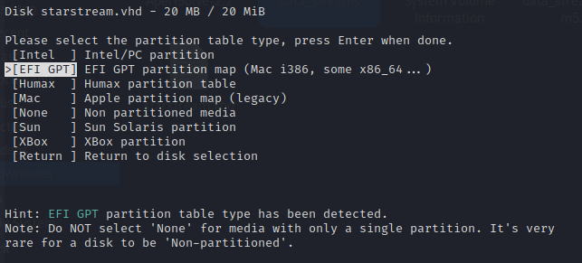
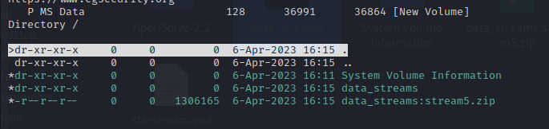
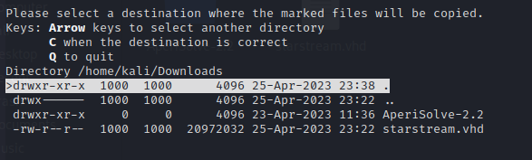
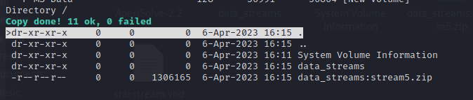
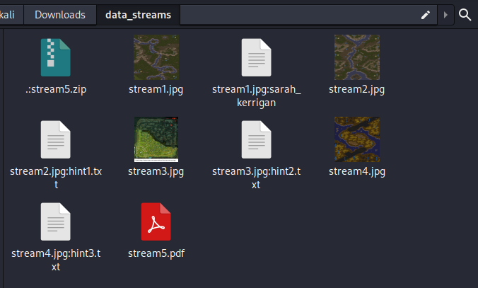
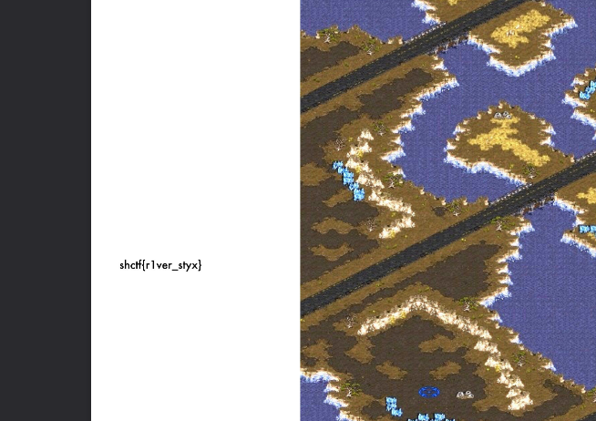

# space_stream

Writeup by: [j4asper](https://github.com/j4asper)

---

## Challenge Description

Our recon troops gathered information about the enemy territory and reported back to our Planetary Fortress. However, Zerg's Red team hackers infiltraded our database and hid all information about where their main Lair is located. Can you recover the missing image for us?

[startstream.vhd](./files/starstream.vhd)

## Challenge Solution

Whenever i have been given a virtual disk file, i either mount it, if we know that the data is intact, or use a tool like [Autopsy](https://www.autopsy.com/) or `testdisk` a linux CLI tool that can also recover files. The description hints that there is a missing file, so for this i will use testdisk, but you can also use autopsy if you are on windows.

So to use testdisk on the file, we simple run the first command `testdisk startstream.vhd`. Testdisk will ask for what disk to use, and since there is only one, we just proceed by pressing Enter.

Testdisk will automatically detect the filesystem and preselect the partition table type we want to use.

Press Enter to select the detected partion type, and then press enter again to analyse the disk, and then again to perform a quick search. When it has performed the scan, press `Shift + P` to list the files in the virtual disk. Press `a` to select all files.

Then press `Shift + C` to copy (extract) the selected files.

Now you need to select where to place the files that you have selected, i will just go with the default option to store it i nthe same directory as the virtual disk file. When you have selected the save location, press `Shift + C`.

You should now see the confirmation, that te files were saved successfully and be able to see them in the save location.

We are done with testdisk now, it can just be closed. Let's look at the files we extracted. You can ignore the `data_streams:stream5.zip` file, this is just a copy of the zip file found in the `data_streams` folder.

I noticed that when i extracted the zip file `stream5.zip` located in the `data_streams` folder, a pdf appears, but can't be opened because it's password protected.

Let's keep this in mind when going through the `data_streams` folder. I am not sure if testdisk does this for us, but it looks like it extracted text files from the different pictures because the text files are named `stream1.jpg:sarah_kerrigan`, but this makes the process a lot quicker for us, because opening the file `stream1.jpg:sarah_kerrigan` hints that the user uses her name as her password. So we assume that `sarah_kerrigan`, could be the password.

**Minor note:** *When the CTF ended, some people said that half of the pdf was missing, and this could be because of the tool they used to open the pdf. My kali installation defaults pdf's to open in firefox and i can see the whole pdf file.*

When copying in the password, we see that it was correct, we opened the pdf file and can see the flag at the left side.

